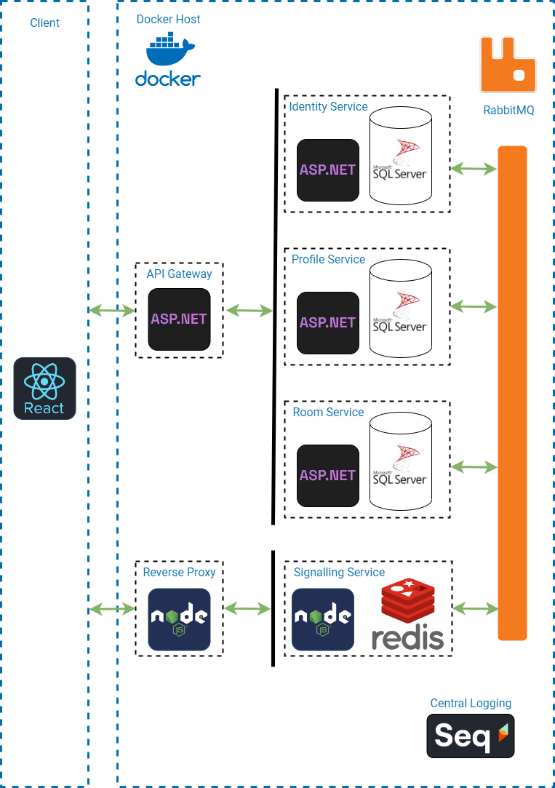

# BİTİRME ÇALIŞMASI PROJESİ
Bu repo G181210068 numaralı Oğuzhan Güneş'in Bitirme Çalışması projesini içermektedir.

**Öğrenci:** Oğuzhan GÜNEŞ 
**Numarası:** G181210068 
**Ders:** Bitirme Çalışması 
**Ders Grubu:** 2E 
**Projenin Konusu:** Mikroservis Mimarisi ile Görüntülü Görüşme Uygulaması

## Projenin Mimarisi:

- Projede 4 adet mikroservis bulunmaktadır. Bu servisler Kimlik Servisi (Identity Service), Profil Servisi (Profile Service), Oda Servisi (Room Service), Sinyalleşme Servisi (Signalling Service) şeklindedir.
- Kimlik Servisi, kullanıcıların uygulama üzerindeki kimliklerinin yönetimi için kullanılan RESTFUL servistir. Bu servis aracılığıyla kullanıcılar uygulamaya kayıt olma ve giriş yapma işlemlerini gerçekleştirir.
- Profil Servisi kullanıcıların uygulama üzerindeki profillerinin yönetimi ve ilişkilerinin yönetimini sağlayan RESTFUL mikroservistir.
- Oda Servisi, uygulamada bulunan chat/video odalarının yönetimi için hazırlanmış RESTFUL mikroservistir.
- Sinyalleşme Servisi uygulamanın gerçek zamanlı olaylarının yönetimini sağlayan Socket.io (WebSocket) servisidir. Bu servis ile gerçek zamanlı işlemler (örneğin anlık mesajlaşma) gerçekleştirilmektedir. Kullanıcıların kimlikleri ile Socket.io oturumlarının eşleştirilmesi sırasında Redis'ten faydalanılmaktadır.
- İstemci uygulaması React teknolojisi kullanılarak SPA (Single Page Application) olarak tasarlanmış, bu sayede daha iyi bir kullanıcı deneyimi hedeflenmiştir. Tailwind CSS ile stillendirmeler sağlanmıştır.
- İstemciler WebRTC üzerinden gecikmesiz görüntülü görüşme gerçekleştirebilmektedir.
- İstemci ile mikroservisler arasındaki iletişim bir API Gateway üzerinden gerçekleştirilmektedir. Bu sayede mikroservis katmanına direkt erişim engellenmiştir.
- İstemci, Sinyalleşme Servisi ile kurduğu WebSocket bağlantısını bir Reverse Proxy üzerinden gerçekleştirir. Bu yapı yük dağılımı (load balancing) gibi unsurların kolayca uygulanabilmesi hedeflenmiştir.
- Uygulamanın sağlığının, genel durumunun izlenmesi amacıyla merkezi loglama sistemi Datalust Seq platformu kullanılmıştır. Bu sayede tüm servislerin logları tek bir yerden yönetilebilir haldedir.
- Tüm uygulamalar (mikroservisler, api gateway, reverse proxy, istemci uygulaması olmak üzere) Docker üzerinde Host edilmiştir. Konteyner orkestrasyonunu sağlamak için Docker Compose'dan yararlanılmıştır.

## Proje Özellikleri:
- Kullanıcılar mesajlaşma, görüntülü görüşme gerçekleştirebilir.
- Kullanıcılar arkadaşlık isteği gönderebilir.
- Kullanıcılar, arkadaşları olan diğer kullanıcıları arayabilir (direct call).

## Kullanılan Teknolojiler:
- Asp.Net Core
- Node.js
- React
- SQL Server
- Socket.io
- RabbitMQ
- Redis
- WebRTC
- Tailwind CSS
- Datalust Seq
- Docker
- Docker Compose